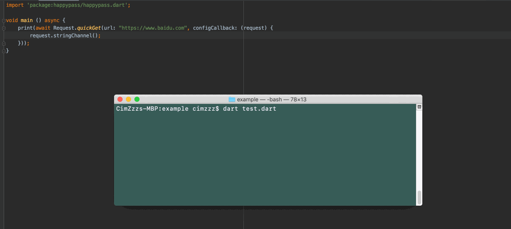

## happypass

happy pass,pass happy to everybody!

`happypass` 是一个高度自由化、可定制的 http 请求库，如果你喜欢掌控自己的代码，那么一定会爱上它！

本项目是开源项目，如果大家有好的想法和意见，可以告知我或者一起参与其中，共同维护我们的开源环境。

### 快速集成

当前最新版本为: 1.1.0

在 "pubspec.yaml" 文件中加入
```yaml
dependencies:
  happypass: ^1.1.0
```

[github](https://github.com/CimZzz/happypass)

```text
https://github.com/CimZzz/happypass
```

### 最详细的示例

`happypass` 字面意思就是想要 `pass happy to everybody`，对于提高工程师使用体验更是视为重中之重。所以在 `happypass` 中，有着大量详细示例以供参考，帮助我们工程师
能够快速上手使用。

[示例目录](https://github.com/CimZzz/happypass/blob/master/example)

### 1.0.8 最新特性 - 模拟请求拦截器

`happypass` 支持请求模拟拦截，让开发者在离线状态或者后台功能尚未开发完善时返回模拟结果，保证开发逻辑的完整性，而这一切仅仅需要配置一个 `MockClientPassInterceptor` 即可实现:

```dart
final request = Request.construct();
request.addFirstInterceptor(MockClientPassInterceptor((builder) => {
    "www.baidu.com": builder.mock(
        get: [
            builder.doDirectly(() => SuccessPassResponse(body: "mocked!"))
        ]
    )
}));
```

上述配置了一个 `MockClientPassInterceptor`，将全部导向 `www.baidu.com` 的 `GET` 请求全部拦截，并返回一个指定的响应结果。

下面的动态图能更直观的说明这一点:



### 构建一个请求 (Request)

`happypass` 将请求对象抽象为 `Request` 类，借由配置 `Request` 来实现自定义请求的目的。

下面是一个极简的示例:
```dart
import 'package:happypass/happypass.dart';
void main() async {
	PassResultResponse result = await Request.quickGet(url: "https://www.baidu.com/", configCallback: (request) {
		request.stringChannel();
	});

	print(result);
}
```

仅仅几行代码，你就完成了一次 `GET` 请求！

当然，这是最基本的一小部分功能，还有非常多的强大功能帮助你实现主宰自己的 `http` 请求。

如果想要全面了解 `happypass` 功能覆盖，还请查看[详细示例](https://github.com/CimZzz/happypass/blob/master/example)

对于上面的示例，我们可以做一些扩展配置，如设置请求头部等:

```dart
request.setRequestHeader("content-type", "application/json");
```

> 需要注意的是，Request 无法直接实例化。如果想要构建一个全新的 `Request` 对象，请使用 `Request.construct()` 方法

想了解 `happypass` 当前版本全部的配置，[点击查看](https://github.com/CimZzz/happypass/blob/master/example/example2.dart)

### RequestPrototype - 请求原型

RequestPrototype(请求原型)，也可以理解为请求的`模板`。利用请求原型预先配置好某些属性，然后在使用的时候快速生成一个配置好的请求，这样做的好处是避免重复配置请求参数，防止不必要的代码冗余。

实例化一个请求原型
```dart
import 'package:happypass/happypass.dart';
void main() async {
    RequestPrototype prototype = RequestPrototype();
}
```

像请求一样，我们可以为其配置一个基于 utf8 字符串的编解码器

```dart
prototype.stringChannel();
```

量化生成并执行请求

```dart
// 快速孵化请求，量化执行
for(int i = 0 ; i < 10 ; i ++) {
    print(await prototype.spawn().GET().doRequest());
}
```

从上面小例子可以大致地了解请求原型的作用 ———— `模板`。

了解更多 `RequestPrototype` 配置，点击查看 [点击查看](https://github.com/CimZzz/happypass/blob/master/example/example4.dart)

### 快速请求方法

可能在某些情况下，我们想要简化代码复杂度，优化可读性，可以使用 `happypass` 提供的快速请求方法:

- quickGet: 快速 `GET` 请求
- quickPost: 快速 `POST` 请求

这两个方法都可以设置请求原型的方式来孵化请求

```dart
Request.quickGet(
    url: "xxx",
    prototype: prototype,
);

Request.quickPost(
    url: "xxx",
    body: xxx,
    prototype: prototype,
);
```

关于这两个方法更为细致地介绍，请参考样例，[点击查看](https://github.com/CimZzz/happypass/blob/master/example/example5.dart)

### HTTP 拦截器

`happypass` 提供了强大的拦截器功能，在这里你可以对自己的请求进行高度自由化的定制！首先让我们了解一下`拦截器`的工作原理吧！

拦截器是整个 `happypass` 的核心，每个请求缺省都会带有一个 `BusinessPassInterceptor` 拦截器。该拦截器的作用就是执行实际的请求逻辑。

拦截器的工作原理可以简单描述为一条请求链路，最终的目的是获取响应结果。

> 这里指的响应结果为 `ResultPassResponse` 的子类。该类是 `happypass` 定义的响应结果类
>
> 该类有两个子类，分别表示请求的成功与失败:
>
> - ErrorPassResponse: 表示请求失败
>
> - SuccessPassResponse: 表示请求成功

正常情况下，拦截器的工作应该如下
> pass request : E -> D -> C -> B -> A -> BusinessPassInterceptor
>
> return response : BusinessPassInterceptor -> A -> B -> C -> D -> E

上述完成了一次拦截工作，`Request` 的处理和 `Response` 的构建都在 `BusinessPassInterceptor` 这个拦截器中完成
如果在特殊情况下，某个拦截器（假设 B）意图自己完成请求处理，那么整个流程如下:

> pass request : E -> D -> C -> B
>
> return response : B -> C -> D -> E

上述在 B 的位置直接拦截，请求并未传递到 `BusinessPassInterceptor`，所以 Request 的处理和 `Response` 的构建都应由 B 完成
需要注意的是，如果拦截器只是对 `Request` 进行修改或者观察，并不想实际处理的话，请调用
`PassInterceptorChain.waitResponse` 方法，表示将 `Request` 向下传递，然后将其结果返回表示将 `Response` 向上返回。

> 需要注意的是，如果拦截器不想对请求进行拦截，请务必调用 `PassInterceptorChain.waitResponse` 方法并且其结果返回（或者根据其结果进行二次加工后的结果）
 
我们也可以添加拦截器在请求链路上做一些自定义行为，比如拦截来自某个域名的请求

```dart
// 为了方便演示，我们采用 [SimplePassInterceptor] 类，只需传递回调闭包即可实现拦截的功能
final interceptor = SimplePassInterceptor((chain) async {
	final httpUrl = HttpUtils.resolveUrl(chain.modifier.getUrl());
	if(httpUrl != null && httpUrl.host == "www.baidu.com") {
		return ErrorPassResponse(msg: "block www.baidu.com request");
	}

	return chain.waitResponse();
});
```

上面例子完成了 `block` 全部来自 `www.baidu.com` 域名下的请求。当然，不要忘了将它添加到你的请求配置中，否则这一切都白做了！

```dart
Request.get(url: "https://www.baidu.com", configCallback: (request) {
    request.addFirstInterceptor(interceptor);
})
```

该请求最终的响应结果打印出来为:

```text
block www.baidu.com request
```

相信这个小例子已经让大家对拦截器有了一个初步的了解

更多拦截器的使用方法与详细探究，请参考实例，[点击查看](https://github.com/CimZzz/happypass/blob/master/example)

### 请求 Body、编码器、解码器

`happypass` 中，一次完整请求数据流程大致如下:

1. 请求 Body 经过编码器编码为 `List<int>` 的 `byte` 数据（`GET` 请求会跳过该步骤）
2. 将 `byte` 数据发送，获得响应的 `byte` 数据
3. 将响应的 `byte` 经过解码器解码为指定的数据结构返回

想必编码器与解码器并不陌生，`happypass` 也提供了一些默认的编解码器。

`happypass` 提供的编码器有:
- GZip2ByteEncoder: GZIP 编码器。转换模式为: List<int> -> List<int>（byte 转 byte）
- Utf8String2ByteEncoder: utf8 字符串编码器。转换模式为: String -> List<int>（字符串转 `utf8` 格式的 byte 数据）
- JSON2Utf8StringEncoder: JSON 编码器。转换模式为: Map -> String（Map 转字符串）

`happypass` 提供的解码器有:
- Byte2GZipDecoder: GZIP 解码器。转换模式为: List<int> -> List<int>（byte 转 byte）
- Byte2Utf8StringDecoder: utf8 字符串解码器。转换模式为: List<int> -> String（`utf8` 格式的 byte 数据转字符串）
- Utf8String2JSONDecoder: JSON 解码器。转换模式为: String -> Map（字符串转 Map）

如果以上编码器或者解码器不能满足你的需要，可以定义一个继承自 `HttpMessageEncoder` 或 `HttpMessageDecoder` 继承实现自定义的编解码器。

在需要发送流数据的请求中（比如 `POST` 请求），必须传递一个 `body` 作为请求 body:

> body 参数有两种选择:
>
> 1. 某种类型数据。该类型数据会经过编码器层层编码，最终转换为 `List<int>` 类型的 byte 数据（如果通过编码器转换的最终数据不为 `List<int>`，则会抛出异常中断请求）
>
> 2. `RequestBody` 子类

**`RequestBody` 子类会按照一定的规则提供请求数据，具体可以参考相关示例。**

下面列举一下 `happypass` 提供的 RequestBody
- FormDataBody: 表单键值对请求数据，如 "key1=value1&key2=value2" 这种标准表单结构
- MultipartDataBody: Multipart 表单请求数据，可以传递文件与流数据
- StreamDataBody: 流数据请求数据，直接读取流中数据作为请求数据

**如果以上请求体数据不能满足你的需求，那么去定义一个继承自 `RequestBody` 的类作为属于你自己的自定义 `RequestBody` 吧！**


### 请求中断

`happypass` 允许开发者随时随地中断已经发生的或者尚未发生的请求。

使用方法也很简单：
```dart
void main() async {
    // 首先我们需要实例化一个 RequestCloser 对象
    final requestCloser = RequestCloser();
    // 发送 GET 请求，并使用拦截器，在执行完成请求后中断
    final result = await Request.quickGet(url: "https://www.baidu.com", configCallback: (request) {
        // 配置请求中断器
        request.addRequestCloser(requestCloser);
    });
}
```

按照上面方法你就成功配置了一个请求中断器。中断方法也很简单

```dart
requestCloser.close();
```

这样即可中断请求，无论当前请求处于何种状态都可以调用此方法（正在执行或者尚未执行，甚至还没有配置该中断器之前）

通常来说，中断都会返回一个 `ErrorPassResponse`，但是在特定情况下，也可以中断请求立即返回一个指定的响应结果:

```dart
requestCloser.close(finishResponse: /* a response derived from `ResultPassResponse`*/);
```

这样就能由你指定一个任意的请求响应结果，哪怕与该请求期望的响应结果完全无关。

或者在极端情况下，当一个中断器应用到多个请求，在中断的时候，需要根据每个请求返回各自不同的响应结果，可以在构建中断器的时候那么做:

```dart
RequestCloser(responseChooseCallback: (ChainRequestModifier modifier) {
    return ErrorPassResponse();
});
```

配置一个 `RequestCloserResponseChooseCallback`，在中断请求时，每个请求都会触发该回调返回对应的响应结果。
结合请求 `id` 使用可以达到最大效果。

> 如果该回调返回 `null`，那么依旧会采用 `close` 中指定的响应结果

灵活地运用请求中断器，可以使工程师们的编码效率事半功倍。

了解更多请求中断器运用的方法，请参考示例，[点击查看](https://github.com/CimZzz/happypass/blob/master/example/example9.dart)

### 请求代理

`happypass` 提供了十分便捷的代理设置方式，使用以下方法即可快速设置代理:

```dart
request.addHttpProxy("localhost", 8888);
```

请求将会尝试使用 `localhost:8888` 进行代理，如果代理无法生效，仍然会从本地发起请求。

### 超时设置

一般我们对于请求时长都有严格要求，如果超时需要中断当前请求连接并返回异常。按照下面方法，可以非常简单的配置超时时间

```dart

// 设置总超时时间
// 总时长超过超时时间将会抛出异常
// * 拦截器处理时间也算在总时长之内
request.setTotalTimeOut(const Duration(seconds: 5));

// 设置连接超时时间
// 连接时长超过超时时间将会抛出异常
request.setConnectTimeOut(const Duration(seconds: 5));

// 设置读取超时时间
// 读取时长超过超时时间将会抛出异常
request.setReadTimeOut(const Duration(seconds: 5));
```

`happypass` 也提供了相当详细的示例文档，[点击查看](https://github.com/CimZzz/happypass/blob/master/example/example11.dart)

### 请求运行代理

这个概念容易和 `http` 代理混淆，两者的区别如下:

> 请求运行代理: 在请求配置与解析时，可能会发生一些比较耗时的操作（例如解析 JSON），官方建议使用 `Isolate` 来单独处理这些操作，以防止造成
> 卡顿等情况，而请求运行代理就是为了解决这个问题而生的。你可以在请求代理中使用一个 `Isolate` 去执行参数中的回调，然后将其结果返回。
> 
> 请求 HTTP 代理: 使用指定的 HTTP 代理服务器发送请求。

在 `Flutter` 中，`compute` 方法与请求运行代理高度契合，可以很方便配置

```dart
setRequestRunProxy(<T, Q>(asyncCallback, message) async {
  return await compute(asyncCallback, message);
});
```

这样，复杂的编解码操作都交给另外的 `Isolate` 处理了。

示例中也介绍了 `Dart` 的实现方式，[点击查看](https://github.com/CimZzz/happypass/blob/master/example/example10.dart)

### 设置 Cookie 管理器

`happypass` 可以配置 `CookieManager`，帮助开发者管理请求中的 `Cookie`。

```dart
request.setCookieManager(MemoryCacheCookieManager());
```

> `MemoryCacheCookieManager` 是 `happypass` 提供的一个内存 Cookie 缓存管理器，开发者可以自定义 `CookieManager` 将之替换。
> * 默认情况下，请求是不会携带 `CookieManger`

## 联系我

如果您在使用的过程中有更好的想法，或者发现什么问题，都可以联系我，共同进行交流:

QQ: 1152564696

Mail: 1152564696@qq.com
